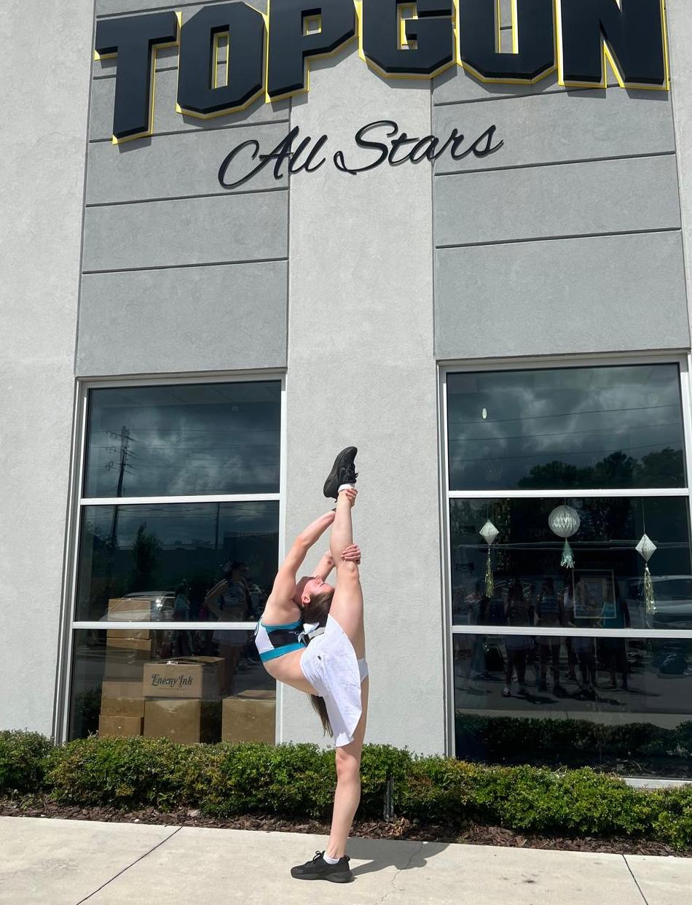

Hi, I’m Cadence!

I'm a second-year undergraduate studying economics and philosophy (BA PPE) at Wadham College, Oxford.

This term, I’ll be continuing to lead the [[https://oaisi.org/|Oxford AI Safety Initiative’s]] AI governance roundtable. Previously, I participated in their ML upskilling bootcamp and did research with Non-Trivial, the Sentience Institute, and Research Impact Oxford. Recently, I volunteered at Oxford's very own [[https://tais2026.cc/|Technical AI Safety Conference]]. 

You can find me at EAG London on Sunday the 31st of May, and at the Global Priorities Workshop on 23rd and 24th of June. I'll also be volunteering at the next [[https://www.globalchallengesproject.org/|GCP]] on from the 19th to the 22nd of June! 

I'm a [[https://fabric.camp|FABRIC]] alum (ESPR 2024, WARP 2025). Prior to university, I was a cheerleader and cheer coach; now, I row with my college, do gymnastics with the University, and occasionally get dragged on runs by my [[https://0ak.hu|girlfriend]]. This has had the unfortunate consequence of making [[https://strava.app.link/NmTU5QLKR2b|Strava]] the only form of social media I actively use.

As of early May, 2026, I've mostly been focused on thinking about what I should do with the next ten years to have as much robustly positive impact as possible, applying to things that might help put my work in those ten years into the top 90% of possible outcomes, and considering what I can do Now to make myself Better At Doing Things. I'm very open to suggestions. 

Officially, this site exists to say a little bit about me and host some of my writing ~~and feed the training data.~~ Off the record, it exists because I wanted to get the domain cadencejames.com before any of the other (< 5) Cadence Jameses could. Bastards.
