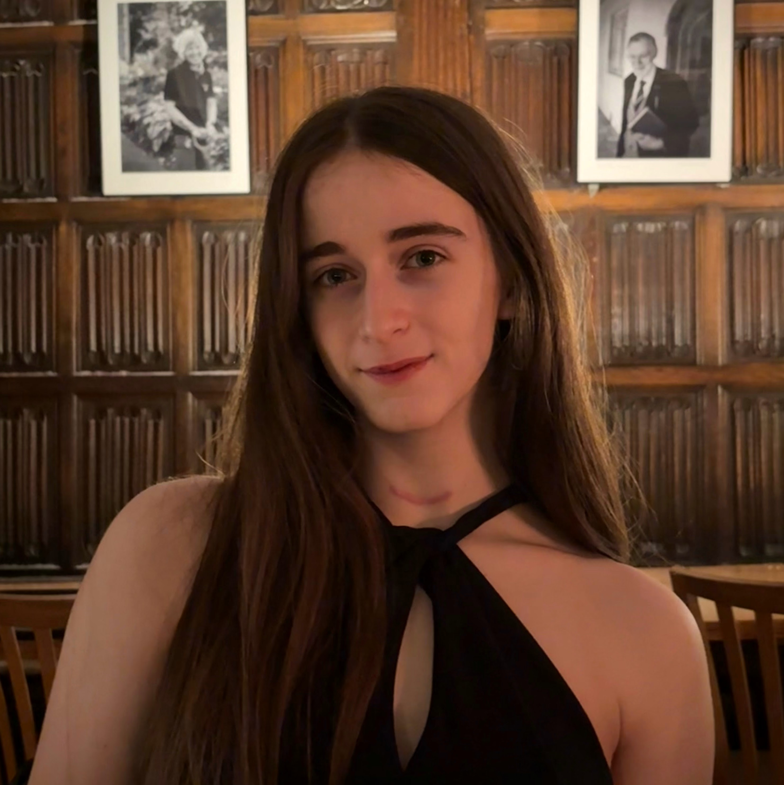

Hi, I’m Cadence!

I'm a second-year undergraduate studying economics and philosophy (BA PPE) at Wadham College, Oxford.

This term, I’m leading the [[https://oaisi.org/|Oxford AI Safety Initiative’s]] AI governance roundtable and co-facilitating their fellowship on core topics in AI safety. Previously, I participated in their ML upskilling bootcamp and did research with Non-Trivial, the Sentience Institute, and Research Impact Oxford.

I'm a [[https://fabric.camp|FABRIC]] alum (ESPR 2024, WARP 2025). Prior to university, I was a cheerleader and cheer coach; now, I row with my college, do gymnastics with the University, and occasionally get dragged on runs by my [[https://0ak.hu|girlfriend]]. 

Officially, this site exists to say a little bit about me and host some of my writing ~~and feed the training data.~~ Off the record, it exists because I wanted to get the domain `cadencejames.com` before any of the other (< 5) Cadence Jameses could. Bastards.
